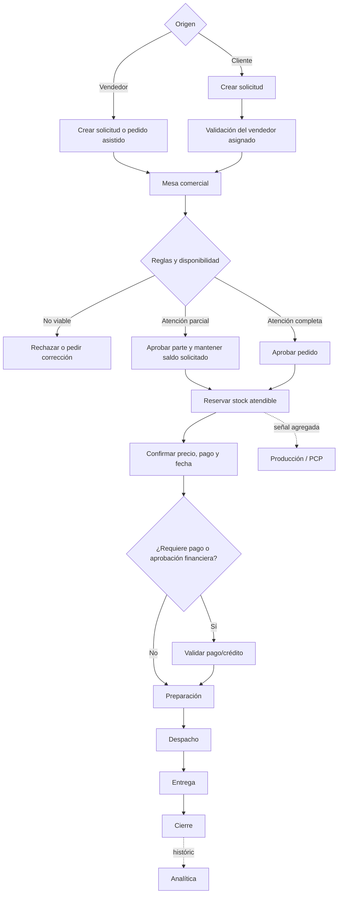

# Boston Pedidos — Especificación funcional consolidada

**Versión:** 1.0  
**Fecha de elaboración:** 6 de septiembre de 2026  
**Fuente principal:** reunión Boston del 3 de septiembre de 2026 (38:24)  
**Estado:** base para validación con Miguel, Hugo, Comercial, Finanzas, PCP y Almacén  

> Este documento convierte la conversación en una propuesta funcional verificable. No supone
> que todas las ideas mencionadas hayan sido aprobadas. Cada punto se clasifica como
> **confirmado**, **propuesto** o **pendiente**.

---

## 1. Resumen ejecutivo

Boston necesita una herramienta que conecte la toma de pedidos con la disponibilidad real,
las condiciones comerciales, la línea de crédito, la producción, el almacén y el despacho.

El problema actual no es solamente que los pedidos se registren tarde o en papel. También se
presentan estos problemas:

- No existe una promesa confiable de cuánto se podrá atender.
- Los pedidos pueden recibirse durante varios días y luego atenderse según decisiones manuales.
- Algunos clientes sobredimensionan sus solicitudes porque esperan recibir solo una parte.
- El vendedor no debe conocer la cantidad total disponible, pero necesita saber qué puede vender.
- La modalidad de pago y el monto comprado modifican los descuentos.
- Una misma relación comercial puede operar mediante varias razones sociales y varios puntos de
  entrega.
- Producción no dispone de una señal temprana y estructurada de la demanda real.
- El cliente no puede consultar fácilmente el avance de su pedido.
- La información histórica existe de forma dispersa y no se explota suficientemente para la
  gestión comercial.

La solución propuesta es un sistema con dos vías de entrada —cliente o vendedor— y una mesa
central de aprobación. El sistema debe reservar existencias al aprobar, proteger la información
sensible del inventario, calcular condiciones comerciales, ofrecer seguimiento del pedido y
generar información para ventas, producción y logística.

---

## 2. Objetivos

### 2.1 Objetivo principal

Lograr que cada solicitud se registre de manera estructurada, se evalúe con reglas comunes y se
convierta en un compromiso comercial trazable y coherente con el stock, el crédito y la capacidad
de atención.

### 2.2 Objetivos específicos

1. Reducir la digitación posterior, los errores y las decisiones informales.
2. Confirmar rápidamente si un requerimiento puede atenderse total o parcialmente.
3. Evitar que dos vendedores comprometan la misma existencia.
4. No revelar al cliente ni al vendedor el inventario total o la producción futura.
5. Incentivar el registro anticipado de la demanda.
6. Dar a producción información sobre artículos, colores y tallas solicitados.
7. Permitir al cliente seguir el estado y la fecha estimada de su pedido.
8. Consolidar el comportamiento comercial por grupo económico, razón social, canal y punto de
   entrega.

### 2.3 Indicadores de éxito sugeridos

- Porcentaje de pedidos capturados directamente en la herramienta.
- Tiempo medio desde el inicio de la toma hasta la confirmación.
- Porcentaje de pedidos atendidos completos y en fecha.
- Porcentaje de solicitudes modificadas por errores de captura.
- Diferencia entre stock mostrado como vendible y stock físico.
- Anticipación media con la que se registra un pedido.
- Demanda no atendida por artículo, color y talla.
- Adopción semanal por vendedor.

---

## 3. Alcance funcional

### 3.1 Incluido

- Registro de clientes, grupos económicos, razones sociales y puntos de entrega.
- Catálogo de productos y variantes por artículo, color y talla.
- Captura de solicitudes por el cliente o por el vendedor.
- Validación y aprobación centralizada.
- Consulta de disponibilidad sin revelar el stock total.
- Reserva de stock y liberación controlada.
- Línea de crédito, deuda/bloqueo y modalidad de pago.
- Cálculo de descuentos y condiciones comerciales.
- Atención total, parcial o futura de una solicitud.
- Estados de pedido, despacho y entrega.
- Enlace o token de seguimiento para el cliente.
- Paneles comerciales, productivos y logísticos.
- Historial y auditoría de decisiones.

### 3.2 Fuera de alcance inicial

- Optimización completa de producción y compra de insumos.
- Corrección integral de inventarios de tela, elásticos y otros insumos.
- Contabilidad general.
- Emisión fiscal definitiva ante SUNAT, salvo que se integre expresamente en una fase posterior.
- Sustitución total de PROMEC o PCP.

---

## 4. Principios de diseño

1. **Disponibilidad sin exposición:** el usuario comercial ve si puede solicitar o vender, no el
   inventario total ni la producción futura.
2. **Solicitud no equivale a compromiso:** registrar lo deseado no obliga a Boston hasta la
   aprobación.
3. **Una aprobación debe reservar:** si el sistema confirma disponibilidad pero no separa el
   stock, la promesa carece de valor.
4. **Una sola regla para todos:** prioridades, límites y descuentos deben ser configurables y
   auditables.
5. **El dato nace una vez:** la información capturada en ventas debe alimentar almacén,
   producción, despacho y análisis.
6. **El cliente ve solo lo suyo:** nunca accede al stock global, pedidos ajenos o información
   interna de producción.
7. **El sistema registra excepciones:** toda modificación manual debe indicar responsable, fecha
   y motivo.

---

## 5. Actores, responsabilidades y permisos

| Actor | Responsabilidad | Puede ver | No debe ver |
|---|---|---|---|
| Cliente | Crear una solicitud, elegir pago, confirmar y seguir su atención | Sus productos disponibles/no disponibles, importes, descuentos aplicables, estado y fecha estimada | Stock total, pedidos de otros clientes, producción detallada, reglas internas |
| Vendedor | Crear o revisar solicitudes de sus clientes y acompañar el cierre | Catálogo vendible, límites aplicables, pedidos y clientes asignados | Stock total, producción futura completa, cartera de otros vendedores |
| Mesa comercial | Revisar solicitudes y convertirlas en pedidos aprobados | Stock actual, reservas, disponibilidad futura autorizada, crédito y reglas de prioridad | Información sin relación con su función |
| Gerencia comercial | Configurar políticas y autorizar excepciones | Vista comercial consolidada, descuentos, prioridades, rendimiento | — |
| Finanzas/Créditos | Mantener línea, deuda, bloqueo y condiciones financieras | Posición financiera del cliente y documentos relacionados | Datos productivos innecesarios |
| PCP/Producción | Planificar según demanda confirmada y demanda pendiente | Demanda agregada por artículo/variante y fechas requeridas | Condiciones financieras del cliente, salvo necesidad justificada |
| Almacén/Despacho | Preparar, despachar y registrar entrega | Pedidos aprobados, reservas, destinos y documentos | Descuentos internos no necesarios para despachar |
| Administrador | Usuarios, permisos, catálogos, parámetros e integraciones | Configuración y auditoría | Contraseñas en texto claro |

### Matiz pendiente sobre el vendedor

La reunión fue consistente en que el vendedor **no debe ver cantidades reales**. Debe validarse
si verá únicamente un semáforo (`disponible`, `parcial`, `por solicitar`) o también un máximo
vendible por cliente y SKU.

---

## 6. Modelo conceptual del negocio

- **Grupo económico:** cliente comercial real o titular que puede controlar varias razones
  sociales.
- **Razón social:** entidad legal/RUC a la que se factura.
- **Punto de entrega:** lugar físico donde se entrega; no necesariamente coincide con la
  dirección fiscal ni identifica por sí solo al grupo económico.
- **Cliente:** usuario o contacto que compra para un grupo económico.
- **Vendedor:** responsable comercial asociado a la cuenta.
- **Solicitud:** expresión de demanda todavía no comprometida.
- **Pedido aprobado:** compromiso de Boston respaldado por stock reservado o por una fecha
  autorizada.
- **Reserva:** cantidad separada para impedir una doble venta.
- **Atención parcial:** parte aprobada ahora; el remanente continúa como solicitud pendiente.
- **Modalidad de pago:** contado, letras, factura/crédito u otra condición autorizada.
- **Regla comercial:** combinación de monto, modalidad de pago, deuda, perfil y campaña que
  determina precio o descuento.

---

## 7. Flujo futuro propuesto

### 7.1 Entrada por cliente

1. El cliente inicia sesión o recibe un acceso seguro.
2. El sistema identifica su grupo económico, razones sociales permitidas y vendedor.
3. Selecciona artículos, variantes y cantidades.
4. La interfaz responde con estados, no con cantidades globales:
   - disponible;
   - atención parcial;
   - no disponible ahora, pero admite solicitud.
5. Elige razón social, destino y modalidad de pago.
6. Envía la solicitud.
7. El vendedor la revisa y la mesa la aprueba, modifica o rechaza.

### 7.2 Entrada por vendedor

1. El vendedor elige el grupo económico y la razón social.
2. Registra el requerimiento frente al cliente.
3. El sistema aplica límites y muestra disponibilidad comercial sin stock total.
4. Puede cerrar lo atendible y dejar el faltante como solicitud.
5. Envía a la mesa cuando la regla requiera aprobación.

### 7.3 Mesa comercial

La mesa recibe una cola única y debe poder:

- ordenar por fecha de ingreso, fecha requerida, perfil, crédito y urgencia;
- detectar solicitudes duplicadas o infladas;
- comparar demanda con stock libre, reservado y disponibilidad futura autorizada;
- aprobar todo, aprobar parcialmente, modificar, devolver o rechazar;
- registrar la razón de cada decisión;
- distribuir existencias manualmente o aceptar una recomendación del sistema.

### 7.4 Seguimiento

El cliente recibe un enlace seguro o accede a un portal con estados comprensibles:

`Solicitud recibida → En revisión → Aprobada → Preparando → Despachada → Entregada`

También debe ver cantidades aprobadas, pendientes o rechazadas, fecha estimada y, cuando
corresponda, datos del despacho. No debe ver estados técnicos internos.

---

## 8. Estados y transiciones

### 8.1 Solicitud

| Estado | Significado | Salidas permitidas |
|---|---|---|
| Borrador | Aún no enviada | Enviada, cancelada |
| Enviada | Espera revisión | En revisión, cancelada |
| En revisión | Vendedor o mesa la evalúa | Observada, aprobada, parcial, rechazada |
| Observada | Requiere corrección | Enviada, cancelada |
| Aprobada | Se crea compromiso completo | Convertida en pedido |
| Parcial | Una parte se convierte en pedido | Pendiente, cerrada, rechazada |
| Rechazada | Boston no atenderá | Final |
| Cancelada | El solicitante desistió | Final |

### 8.2 Pedido

| Estado | Acción principal |
|---|---|
| Pendiente de condición | Falta pago o aprobación financiera |
| Confirmado | Condiciones aceptadas y stock reservado |
| En preparación | Almacén prepara el pedido |
| Listo para despacho | Pedido preparado |
| Despachado | Salió hacia el destino |
| Entregado | Recepción registrada |
| Cerrado | Sin pendientes administrativos |
| Anulado | Compromiso cancelado y reserva liberada |

Toda transición debe registrar usuario, fecha, origen, comentario y cambios realizados.

---

## 9. Reglas de negocio

### RN-01. Privacidad del inventario — confirmado

Cliente y vendedor no ven el total disponible ni el detalle de lo que llegará. La interfaz debe
devolver una respuesta comercial limitada. La mesa sí necesita una vista suficiente para decidir.

### RN-02. Stock vendible — propuesto

`stock vendible = existencia confiable − reservas vigentes − stock de seguridad`

El stock de seguridad debe configurarse por producto o familia. No debe codificarse como un
porcentaje fijo sin validación.

### RN-03. Reserva al aprobar — confirmado conceptualmente

Una aprobación sobre stock actual genera una reserva atómica. Dos usuarios no pueden reservar la
misma unidad. Falta definir duración y causales de liberación.

### RN-04. Solicitud de producto no disponible — confirmado

El usuario puede solicitar más de lo disponible. Esa diferencia no se presenta como stock ni como
pedido confirmado; queda como demanda pendiente con una fecha estimada solo cuando sea autorizada.

### RN-05. Orden y prioridad — pendiente

La fecha de entrada debe influir, pero no se acordó si domina sobre el perfil del cliente. La
regla deberá considerar, como mínimo:

- fecha y hora de solicitud;
- perfil o segmento;
- cumplimiento de pago;
- línea de crédito;
- cantidad solicitada por SKU;
- urgencia autorizada;
- objetivo de completar pedidos o repartir proporcionalmente.

Ninguna asignación automática debe implementarse hasta que Gerencia Comercial defina el objetivo:
maximizar pedidos completos, repartir entre todos, proteger clientes estratégicos u otro.

### RN-06. Límite por cliente y artículo — propuesto

El sistema podrá fijar un máximo vendible por cliente, producto o campaña para evitar que un solo
pedido absorba toda la disponibilidad. El usuario verá el máximo permitido, no la existencia total.

### RN-07. Línea de crédito — confirmado conceptualmente

Cada pedido se valida contra la línea disponible del cliente o grupo económico. Debe definirse si
la línea se comparte entre razones sociales y cuál es el sistema fuente.

### RN-08. Modalidad de pago — confirmado

El pedido debe registrar la modalidad antes de calcular el total. Se mencionaron contado, letras y
factura/crédito, además de una posible combinación de modalidades. Las definiciones y descuentos
exactos requieren validación de Comercial y Finanzas.

### RN-09. Descuentos — confirmado conceptualmente, valores pendientes

Los descuentos pueden depender de:

- monto realmente atendido;
- modalidad de pago;
- deuda o morosidad;
- perfil del cliente;
- campaña, artículo o beneficio especial.

El sistema debe recalcular en tiempo real y mostrar cuánto falta para alcanzar un tramo. Los
porcentajes actuales del prototipo no se consideran aprobados por esta reunión.

### RN-10. Mezcla de pagos — pendiente

Si se permite pagar una parte al contado y otra con letras, cada porción debe tener importe,
descuento y documento claramente separados. Finanzas debe definir si esto ocurre dentro de un
pedido o exige dividirlo.

### RN-11. Compromiso de fecha — propuesto

La fecha mostrada al cliente debe provenir de stock reservado o de una promesa autorizada por
PCP. Una estimación no confirmada debe etiquetarse como tal.

### RN-12. Grupo económico — confirmado conceptualmente

Las estadísticas, límites y riesgo deben poder consolidarse por grupo económico sin perder el
detalle de razón social y destino. Un grupo puede tener varias razones sociales y cada razón
social varios puntos de entrega.

### RN-13. Canal de venta — propuesto

Cada operación debe identificar el canal —por ejemplo mayorista, tienda física, online u otro—
mediante un catálogo explícito. No conviene inferirlo permanentemente de la serie de factura, aunque
esa relación puede usarse para migrar el histórico.

---

## 10. Módulos funcionales

### M1. Identidad y acceso

- Inicio de sesión y recuperación de acceso.
- Roles y permisos por función.
- Asociación entre cliente, grupo económico y vendedor.
- Enlaces de seguimiento con token revocable y vencimiento.

### M2. Maestro de clientes

- Grupo económico y titular.
- Razones sociales/RUC.
- Direcciones fiscales.
- Puntos de entrega.
- Contactos y usuarios del portal.
- Vendedor asignado, perfil, canal y zona.
- Línea, deuda, bloqueo y condiciones autorizadas.

### M3. Catálogo y disponibilidad

- Artículo, línea, género, color, talla y unidad de venta.
- Estado del producto y precio aplicable.
- Stock físico, reservado, seguridad y vendible para usuarios autorizados.
- Respuesta simplificada para cliente y vendedor.

### M4. Captura de solicitud/pedido

- Búsqueda y matriz color × talla.
- Cantidad deseada y cantidad atendible.
- Razón social, destino, fecha requerida y modalidad de pago.
- Guardado de borrador.
- Cálculo preliminar de importes y beneficios.

### M5. Mesa de aprobación

- Bandeja de solicitudes.
- Filtros, prioridades y alertas.
- Aprobación total/parcial, observación y rechazo.
- Reserva de stock.
- Recomendación de distribución con explicación de la regla aplicada.

### M6. Crédito y condiciones comerciales

- Consulta de línea total, utilizada y disponible.
- Morosidad y bloqueos.
- Tramos de descuento configurables.
- Condiciones por forma de pago.
- Autorizaciones y excepciones.

### M7. Preparación y despacho

- Cola de pedidos aprobados.
- Picking, faltantes, sustituciones y preparación.
- Múltiples destinos y documentos cuando corresponda.
- Registro de salida, transportista, fecha y entrega.

### M8. Portal de seguimiento

- Estado y línea de tiempo.
- Resumen de cantidades confirmadas y pendientes.
- Fecha estimada y evidencia de entrega.
- Confirmación o reporte de observaciones por el cliente.

### M9. Analítica

- Ventas y demanda por grupo, razón social, artículo, color, talla, zona y canal.
- Evolución mensual y comparación interanual.
- Clientes que redujeron o dejaron de comprar.
- Demanda no atendida y solicitudes rechazadas.
- Concentración de ventas y colores.
- Mapa de puntos de entrega y distribución.
- Cumplimiento de fecha y porcentaje de pedidos completos.

### M10. Administración y auditoría

- Catálogos, parámetros, prioridades y stock de seguridad.
- Usuarios, permisos y responsables.
- Historial de cambios y exportación de auditoría.
- Monitoreo de integraciones.

---

## 11. Datos e integraciones

### 11.1 Fuentes que deben confirmarse

| Dato | Posible fuente | Validación necesaria |
|---|---|---|
| Stock terminado | PROMEC/PCP | Cuál es el dato más confiable y con qué frecuencia cambia |
| Producción en mesa/taller | PCP u otra fuente | Qué nivel puede usar la mesa y qué fecha es confiable |
| Clientes y RUC | PROMEC/ERP | Calidad, duplicados y vigencia |
| Punto de entrega | Guía/PROMEC | Diferenciarlo de dirección fiscal |
| Grupo económico | No identificado | Probablemente requiere maestro nuevo y carga inicial manual |
| Línea de crédito y deuda | Finanzas/otro sistema | Sistema oficial y actualización |
| Facturas y series | ERP/facturación | Relación real entre serie y canal |
| Histórico de ventas | Facturas/ERP | Disponibilidad de SKU, cantidad, precio, cliente, fecha y canal |

### 11.2 Condiciones técnicas mínimas

- La reserva debe realizarse en servidor y dentro de una transacción.
- Los movimientos recibidos del ERP deben ser idempotentes.
- Debe conservarse el identificador del sistema fuente.
- Los importes monetarios deben almacenarse sin errores de coma flotante.
- Las integraciones deben mostrar su última sincronización y alertar fallos.
- La carga histórica debe incluir reglas de deduplicación de clientes y direcciones.

---

## 12. Seguridad y privacidad

- Acceso por rol y mínimo privilegio.
- Separación estricta entre stock interno y respuesta comercial.
- Clientes limitados a sus propios grupos, RUC y pedidos.
- Registro de accesos y cambios sensibles.
- Tokens de seguimiento no predecibles, revocables y con caducidad.
- Cifrado en tránsito y protección de credenciales.
- No exponer datos productivos en mensajes, enlaces o respuestas del navegador.
- Revisión de seguridad antes de habilitar acceso externo.

---

## 13. Reportes prioritarios

1. Demanda solicitada, aprobada, atendida y no atendida por SKU.
2. Pedidos completos, parciales y tardíos.
3. Ventas por grupo económico y por razón social.
4. Variación mensual e interanual por cliente.
5. Clientes con caída significativa de compra.
6. Descuentos otorgados por modalidad y autorizante.
7. Uso de línea y clientes bloqueados.
8. Reservas vigentes, vencidas y liberadas.
9. Distribución geográfica de puntos de entrega.
10. Diferencia entre stock del sistema, stock reservado y hallazgos físicos.

---

## 14. Riesgos principales

| Riesgo | Consecuencia | Mitigación propuesta |
|---|---|---|
| Stock fuente inexacto | Promesas incumplidas | Stock de seguridad, conciliación, trazabilidad y piloto controlado |
| No reservar al aprobar | Doble venta | Reserva transaccional obligatoria |
| Mostrar demasiado stock | Fuga de información y tanteo del inventario | Semáforo o máximo vendible, límites y monitoreo de intentos |
| Prioridad sin definición | Conflictos comerciales | Política aprobada, configurable y auditable |
| Datos de cliente duplicados | Crédito y reportes incorrectos | Maestro de grupo económico y depuración inicial |
| Reglas de descuento incompletas | Precios erróneos | Validación formal con Comercial y pruebas por escenarios |
| Prototipo decidido sin usuarios | Baja adopción | Observar a vendedores y validar con Hugo antes del desarrollo definitivo |
| Promesa futura no confiable | Pérdida de credibilidad | Separar estimación de fecha comprometida |

---

## 15. Decisiones obtenidas de la reunión

### Confirmadas o fuertemente respaldadas

- El vendedor no debe ver la cantidad total de stock.
- El cliente tampoco debe ver producción futura ni información interna.
- Se debe poder registrar demanda aun cuando no haya stock disponible.
- La modalidad de pago modifica las condiciones comerciales.
- El sistema debe manejar línea de crédito o límites por cliente.
- Debe existir trazabilidad del pedido para el cliente.
- Las solicitudes deben centralizarse para su revisión o aprobación.
- Ventas, producción y logística deben beneficiarse de la misma información.
- Se necesita consolidación por grupo económico, además de razón social y destino.
- El sistema comercial debe estar conectado al almacén; de otro modo la reserva no sirve.
- Antes de cerrar el diseño es necesario escuchar a Hugo y revisar con Miguel.

### Todavía no confirmadas

- Quién puede originar directamente un pedido firme y quién solo una solicitud.
- Si la mesa aprueba todos los pedidos o solo excepciones.
- Fórmula exacta de prioridad.
- Política de reparto cuando el stock es insuficiente.
- Límites por producto y cliente.
- Porcentajes y tramos de descuento.
- Mezcla de modalidades de pago en un mismo pedido.
- Duración de reservas.
- Fuente oficial de crédito y deuda.
- Uso exacto de PROMEC frente a PCP.
- Confiabilidad de fechas de producción futura.

---

## 16. Preguntas para la próxima sesión

### Para Hugo y vendedores

1. Muéstrenme un pedido real desde que el cliente lo solicita hasta que se digita.
2. ¿El vendedor debe crear un pedido firme o enviar siempre una solicitud?
3. ¿Qué información mínima de disponibilidad necesitan frente al cliente?
4. ¿Qué significa exactamente el máximo que pueden vender por artículo?
5. ¿Cómo identifican hoy una urgencia y quién la autoriza?
6. ¿Cuándo un pedido puede salir parcial y cuándo debe esperar a completarse?
7. ¿Qué parte del prototipo actual no usarían y por qué?

### Para Miguel/Gerencia Comercial

1. ¿Qué regla manda cuando el stock no alcanza: llegada, perfil, reparto o pedido completo?
2. ¿Quién opera la mesa y en qué horario?
3. ¿Qué porcentajes de stock puede comprometer cada canal o vendedor?
4. ¿Qué descuentos corresponden a contado, letras y factura/crédito?
5. ¿Los descuentos dependen del monto solicitado o del monto confirmado?
6. ¿Qué históricos y alertas necesita ver primero?

### Para Finanzas/Créditos

1. ¿Dónde vive la línea de crédito y se asigna por RUC o grupo económico?
2. ¿Cómo se calcula la línea disponible?
3. ¿Qué deuda impide acceder a descuentos o bloquea un pedido?
4. ¿Puede dividirse un pedido entre contado y letras?
5. ¿Qué aprobación y documento requiere cada modalidad?

### Para PCP y Almacén

1. ¿Cuál es la fuente oficial del stock terminado?
2. ¿Qué movimientos generan discrepancias?
3. ¿Qué stock de seguridad requiere cada familia?
4. ¿Qué fecha futura puede prometerse con confianza?
5. ¿Cómo se reserva y libera stock hoy?
6. ¿Quién confirma preparación, despacho y entrega?

---

## 17. Primer prototipo que debe validarse

El prototipo de validación no necesita resolver todavía toda la integración. Debe demostrar cinco
escenarios con datos controlados:

1. **Pedido completamente disponible:** se aprueba, reserva y muestra fecha.
2. **Pedido parcialmente disponible:** separa la parte atendible y conserva demanda pendiente.
3. **Producto no disponible:** permite solicitar sin revelar producción futura.
4. **Cliente sin crédito suficiente:** informa el bloqueo y deriva a aprobación.
5. **Seguimiento:** el cliente consulta el avance mediante un enlace seguro.

### Pantallas mínimas

1. Selección de grupo económico, razón social y destino.
2. Catálogo/matriz de cantidades con indicador de disponibilidad.
3. Condición de pago y simulación de descuentos.
4. Resumen y envío de solicitud.
5. Bandeja de mesa con aprobación total/parcial.
6. Detalle del pedido y reserva.
7. Vista de seguimiento del cliente.
8. Panel básico de demanda no atendida.

### Criterios de aprobación del prototipo

- Un vendedor completa un pedido real sin ayuda y más rápido que con papel más digitación.
- Ninguna pantalla revela la cantidad total a un usuario no autorizado.
- Dos aprobaciones no pueden consumir el mismo stock en la simulación multiusuario.
- El usuario distingue claramente solicitud, pedido aprobado y saldo pendiente.
- Miguel y Hugo pueden explicar el flujo sin contradicciones después de usarlo.
- Comercial valida por escrito los ejemplos de precio y descuento.

---

## 18. Plan de implementación recomendado

### Fase 0 — Validación funcional

- Entrevistar a Hugo, Miguel, Finanzas, PCP y Almacén.
- Ejecutar los cinco escenarios del prototipo.
- Aprobar glosario, reglas, estados y permisos.

### Fase 1 — Núcleo transaccional

- Backend, usuarios, maestro de clientes, catálogo y stock sincronizado.
- Solicitudes, aprobación, pedidos y reserva concurrente.
- Auditoría básica.

### Fase 2 — Condiciones comerciales

- Crédito, deuda, modalidades, descuentos, autorizaciones y excepciones.

### Fase 3 — Operación y cliente

- Preparación, despacho, entrega, notificaciones y portal de seguimiento.

### Fase 4 — Inteligencia comercial

- Histórico depurado, paneles, alertas de caída de clientes y mapa logístico.

### Fase 5 — Optimización

- Recomendación de asignación de stock y señales avanzadas para producción, después de contar con
  datos confiables y una política comercial aprobada.

---

## 19. Próxima decisión concreta

No corresponde programar nuevas reglas de prioridad ni descuentos todavía. La siguiente acción es
una sesión de validación de 60–90 minutos con **Miguel y Hugo**, usando el prototipo existente y
los cinco escenarios del apartado 17. El resultado debe ser una tabla firmada o aceptada por correo
con tres columnas: `regla`, `decisión` y `responsable`.

Una vez cerrada esa tabla, el equipo puede convertir esta especificación en historias de usuario y
planificar el backend sin construir sobre supuestos contradictorios.
