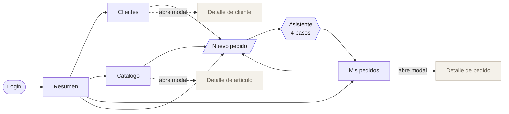
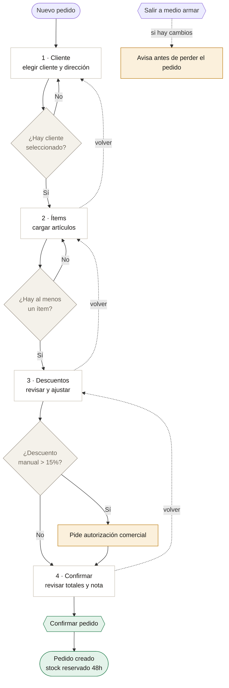
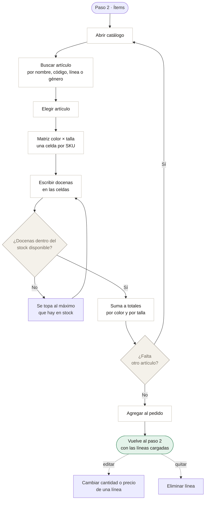
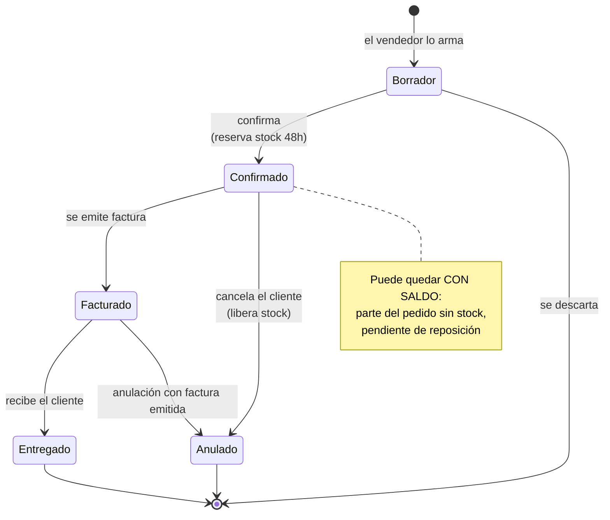
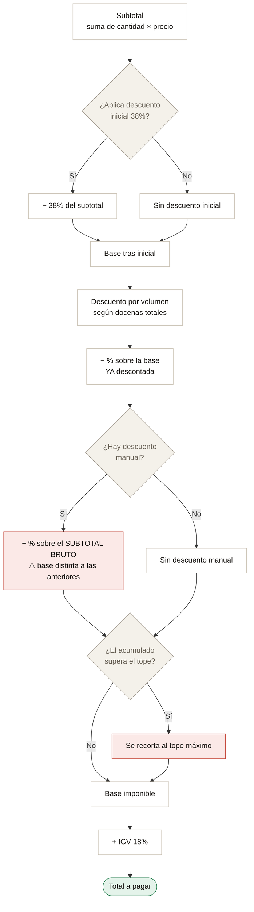

# Flujos — Boston Pedidos

Diagramas del prototipo tal como está construido hoy (agosto 2026, frontend con datos simulados).
Sirven para explicar el sistema y para validar reglas con Comercial, Finanzas y los vendedores.

Lo que aparece en **rojo** son decisiones o reglas **sin confirmar**: eso es lo que hay que validar.

---

## 1 · Navegación general

Cómo se mueve el vendedor por la aplicación.

**Para validar:** el vendedor entra a armar un pedido desde cuatro lugares distintos.
¿Cuál usa de verdad? Si siempre arranca desde el cliente, el asistente debería empezar
con el cliente ya elegido.

---

## 2 · El asistente de pedido (4 pasos)

Qué bloquea el avance en cada paso.

**Para validar:**
- El umbral de **15%** para pedir autorización: ¿es el real?
- Hoy la autorización se confirma en pantalla, sin pedir clave ni avisar a nadie. ¿Quién autoriza y cómo se entera?
- ¿El vendedor puede guardar un borrador y seguir después? Hoy no: si sale, pierde el pedido.

---

## 3 · Cargar ítems desde el catálogo

El flujo que se rediseñó: la matriz color × talla.

**Para validar:**
- Se carga en **docenas**. ¿Alguna vez se piden unidades sueltas? Hoy no se puede.
- El **precio es editable por línea** en el paso 2. ¿Quién puede hacerlo y hasta dónde?
- El stock que se muestra es *disponible* = stock − reservado. ¿Es el número que el vendedor espera ver?

---

## 4 · Estados del pedido

**Para validar:**
- ¿La reserva de **48 horas** existe de verdad, y quién la libera cuando vence?
- Un pedido **con saldo**: ¿se factura lo que hay y el resto queda pendiente, o se espera completo?
- ¿Se puede anular algo ya facturado? El diagrama lo permite; hay que confirmar si es correcto.
- ¿Quién puede cambiar de estado: el vendedor, o solo administración?

---

## 5 · Cómo se calcula el total

El orden importa: cada descuento se aplica sobre una base distinta.

### Escala de descuento por volumen

| Docenas totales | Nivel | Descuento |
|---|---|---|
| 0 – 4 | 1 | 11% |
| 5 – 49 | 2 | 12% |
| 50 – 99 | 3 | 13% |
| 100 – 199 | 4 | 14% |
| 200 – 249 | 5 | 15% |
| 250 o más | 6 | 18% |

**Para validar — esto es lo más importante del documento:**

1. **La base del descuento manual.** Hoy se calcula sobre el subtotal bruto, mientras que
   el de volumen se calcula sobre el subtotal ya descontado. En un pedido de S/ 13,000
   la diferencia es de unos S/ 500. ¿Cuál es la regla real?
2. **El tope máximo acumulado.** Está puesto en 60% como valor provisional, sin fuente.
   Sin tope, 38% + 18% + 50% manual dejaba el pedido en casi cero.
3. **El descuento inicial de 38%** se aplica por defecto a todos los pedidos.
   ¿Es correcto, o depende del cliente?

---

## Qué falta

Estos flujos describen el **prototipo**, no un sistema en producción:

- No hay backend: nada se guarda. Al recargar la página se pierde todo.
- El login no valida credenciales.
- El stock es simulado; no viene del ERP.
- La confirmación de un pedido no reserva nada realmente ni notifica a nadie.

---

*Documento generado el 12 de agosto de 2026. Los diagramas usan Mermaid: se renderizan
en GitHub, VS Code (con extensión Markdown Preview Mermaid) y Notion.*
